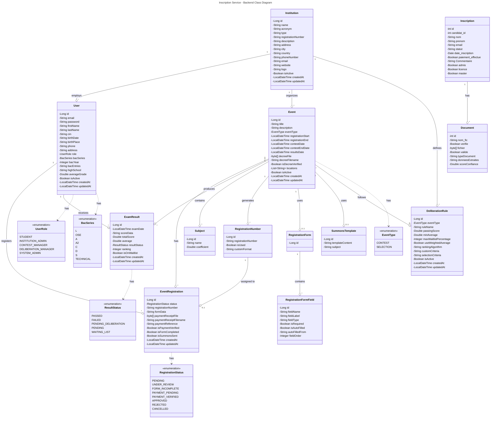

# Backend Class Diagram

This document contains the UML class diagram for the Inscription Service backend.

## Entity Relationship Overview

## Entity Descriptions

### Core Entities

| Entity | Description |
|--------|-------------|
| **Institution** | Universities and educational institutions that organize contests |
| **User** | System users (students, admins, contest managers) |
| **Event** | Contests or selection processes organized by institutions |
| **EventRegistration** | Student registrations for specific events |
| **ExamResult** | Exam scores and deliberation results |

### Supporting Entities

| Entity | Description |
|--------|-------------|
| **Subject** | Exam subjects with coefficients for grade calculation |
| **DeliberationRule** | Rules for automatic grade deliberation |
| **RegistrationForm** | Custom registration form definitions |
| **RegistrationFormField** | Individual fields in registration forms |
| **SummonsTemplate** | Email templates for exam summons |
| **RegistrationNumber** | Pre-generated registration numbers for events |

### Legacy Entities

| Entity | Description |
|--------|-------------|
| **Inscription** | Legacy registration system |
| **Document** | Documents attached to legacy inscriptions |

### Enumerations

| Enum | Values |
|------|--------|
| **UserRole** | STUDENT, INSTITUTION_ADMIN, CONTEST_MANAGER, DELIBERATION_MANAGER, SYSTEM_ADMIN |
| **RegistrationStatus** | PENDING, UNDER_REVIEW, FORM_INCOMPLETE, PAYMENT_PENDING, PAYMENT_VERIFIED, APPROVED, REJECTED, CANCELLED |
| **ResultStatus** | PASSED, FAILED, PENDING_DELIBERATION, PENDING, WAITING_LIST |
| **EventType** | CONTEST, SELECTION |
| **BacSeries** | L, OSE, A, A2, C, D, S, TECHNICAL |

## Key Relationships

1. **Institution → Users**: One institution has many users (admins, managers)
2. **Institution → Events**: One institution organizes many events
3. **User → EventRegistration**: One user can register for many events
4. **Event → EventRegistration**: One event has many registrations
5. **Event → Subject**: One event has multiple exam subjects
6. **User/Event → ExamResult**: Results link users to their scores per event
7. **Event → DeliberationRule**: Events can follow deliberation rules for auto-grading
